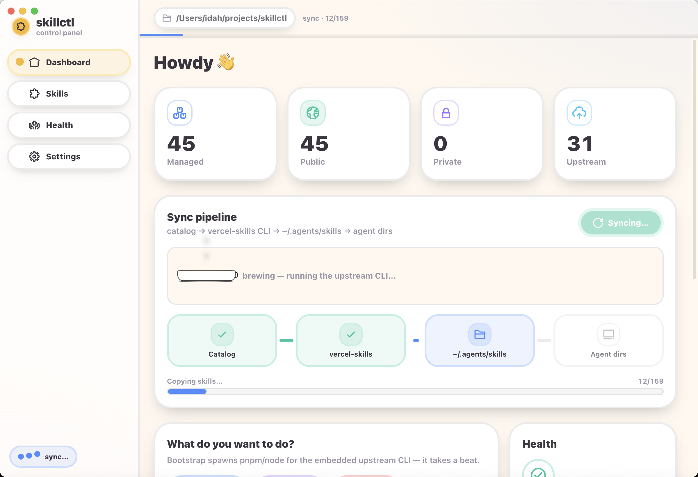
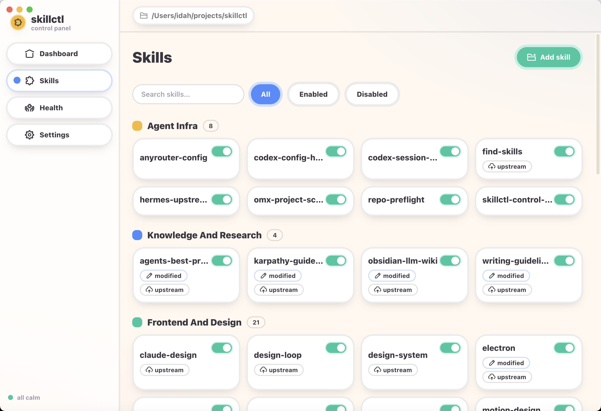
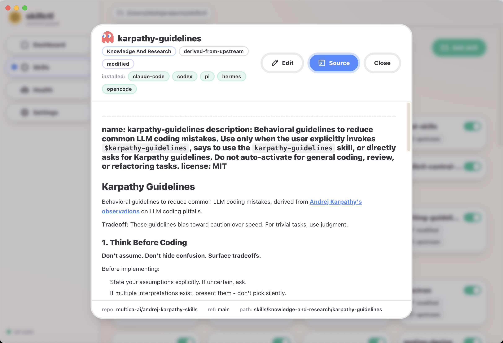

# skillctl

Portable skills control plane for Claude Code, Codex, Pi Agent, Hermes, and OpenCode.

`skillctl` keeps a Git-tracked catalog as the source of truth for public-safe local skills, then uses the upstream `vercel-labs/skills` CLI as its default transport while preserving local policy, health checks, and repair behavior.

It is a control-plane wrapper around `vercel-labs/skills`, not a fork of `vercel-labs/agent-skills`.

## Highlights

- Git-backed skill catalog and provenance
- Embedded upstream transport by default
- Multi-adapter sync for 5 built-in targets
- Health checks, drift detection, and repair
- macOS desktop control panel for day-to-day operations

## Screenshots

<p align="center">
  
  
  
</p>

## What It Does

- Tracks public-safe skills in Git under `skills/`
- Records managed metadata in `skillctl.catalog.json`
- Keeps machine-local state in `.skillctl-local/`
- Vendors `vercel-labs/skills` as a git submodule under `vercel-skills/`
- Uses that embedded upstream as the default install and sync transport
- Syncs managed skills into 5 built-in adapters:
  - `claude-code`
  - `codex`
  - `pi`
  - `hermes`
  - `opencode`
- Detects drift, missing directories, and stale managed indexes with `doctor`
- Repairs managed installs with `repair`

## Workspace Layout

```text
packages/core      # Catalog, schema, adapters, doctor/repair engine, transport integration
packages/cli       # CLI entrypoint and repo-root resolution
apps/electron      # macOS desktop control panel (thin shell over core)
skills/            # Public-safe managed skills committed to Git
manifests/         # Schemas and tracked metadata
vercel-skills/      # Embedded upstream skills CLI submodule
```

## Quick Start

```bash
git clone --recurse-submodules git@github.com:izumi0uu/skillctl.git
cd skillctl
pnpm install
pnpm build
pnpm bootstrap-upstream
pnpm --filter skillctl-cli exec tsx src/index.ts init
pnpm health-suite
```

Or after build:

```bash
node packages/cli/dist/index.js status
node packages/cli/dist/index.js taxonomy --json
node packages/cli/dist/index.js sources --json
```

## Desktop app (macOS)

A cartoon-styled control panel lives in `apps/electron` (electron-vite + React). It is a thin shell over `@skillctl/core`: catalog / doctor / sync / repair / prune / discover / bootstrap / adopt all run through the same engine the CLI uses, exposed over a typed IPC bridge.

Run it in development:

```bash
pnpm --filter @skillctl/core build        # core dist must exist first
pnpm --filter skillctl-electron-shell dev
```

Build a distributable (`.dmg` + `.zip`) for the current architecture:

```bash
pnpm release:mac   # output under apps/electron/release/
```

If Apple signing / notarization secrets are not present, the build is **unsigned**, so Gatekeeper may block a plain double-click. To open it anyway:

- Right-click the app in Finder → **Open** → **Open** in the dialog, or
- Clear the quarantine flag: `sudo xattr -r -d com.apple.quarantine /Applications/skillctl.app`

CI builds arm64 + x64 artifacts via `.github/workflows/release-mac.yml`. If the Apple secrets below are configured, the app is signed and notarized; otherwise CI falls back to an unsigned build. Pushing a `v*` tag attaches the artifacts to a GitHub release with auto-generated notes.

## Release flow

1. Create the release commit + local tag in one step:

```bash
pnpm release:tag 0.2.0
```

This command:

- updates all workspace package versions
- refreshes `pnpm-lock.yaml`
- runs `pnpm release:check`
- creates a Lore-format release commit
- creates a local `v0.2.0` tag

2. Push the release commit and tag:

```bash
git push origin main --tags
```

3. GitHub Actions builds the release artifacts and attaches them to the GitHub release.

If you want the older manual flow, you can still run `pnpm version:set 0.2.0` followed by `pnpm release:check`, commit manually, and then tag manually.

### Optional: signed + notarized macOS releases

To turn on signing/notarization in CI, add these GitHub Actions secrets:

- `APPLE_CERTIFICATE_P12_BASE64`: base64-encoded `.p12` Developer ID Application certificate
- `APPLE_CERTIFICATE_PASSWORD`: password for that `.p12`
- `APPLE_TEAM_ID`: your Apple Developer Team ID
- `APPLE_API_KEY_BASE64`: base64-encoded App Store Connect API key `.p8`
- `APPLE_API_KEY_ID`: App Store Connect API key ID
- `APPLE_API_ISSUER`: App Store Connect issuer ID

When all six secrets are present, the release workflow signs and notarizes automatically. If any are missing, it still produces unsigned `.dmg` + `.zip` artifacts.

Detailed setup checklist: [docs/macos-release-secrets.md](/Users/idah/projects/skillctl/docs/macos-release-secrets.md:1)

## Health Suite

`pnpm health-suite` is the canonical local and CI health command.

It runs this sequence in order:

1. `discover`
2. `sync`
3. `doctor`
4. `verify-sources`

The command prints one JSON report with:

- per-step status and exit codes
- catalog summary
- discovery conflicts
- sync copy/skip counts
- doctor issue summary
- source verification summary

Exit code contract:

- `0`: healthy
- `1`: repairable or advisory verification warnings
- `2`: invalid state, hard errors, or discovery conflicts that need manual resolution

For CI, use:

```bash
pnpm ci:health
```

## Config Model

- `skillctl.config.json`: source roots, enabled adapters, private roots, excludes, live probe policy
- `transport`: which install/sync transport to use; default is `skills-cli` with `embeddedRepoPath` pointing at `vercel-skills/`
- `skillctl.catalog.json`: managed catalog, hashes, targets, visibility
- `.skillctl-local/managed/*.json`: local managed indexes per adapter
- `skillctl taxonomy --json`: canonical grouped category tree for CLI tooling and future Electron surfaces
- `skillctl sources --json`: provenance registry plus category/source summary for audits and UI consumption

By default only `./skills` is discovered as a managed public root. Use `skillctl.config.example.json` as a starting point for adding upstream or private local sources.

## Transport Topology

`skillctl` intentionally keeps the default sync path as:

```text
skillctl catalog + skills/ canonical source
  -> embedded vercel-skills CLI
  -> ~/.agents/skills
  -> per-agent install directories
```

Per-agent install directories currently include:

- `~/.claude/skills`
- `~/.codex/skills`
- `~/.pi/agent/skills`
- `~/.hermes/skills`
- `~/.config/opencode/skills`

This means `~/.agents/skills` is not accidental temporary output. In `skills-cli` mode it is the shared upstream install layer that `skillctl` mirrors into each managed agent adapter.

## Why The Shared Layer Stays

- `skillctl` is intentionally a control plane around the upstream `vercel-skills` installer, not a replacement for its install semantics
- the embedded CLI remains the first transport executor, while `skillctl` adds catalog ownership, provenance, health checks, repair rules, and multi-agent mirroring
- keeping `~/.agents/skills` preserves predictable behavior across adapters when the upstream CLI is the transport authority
- if you manually remove `~/.agents/skills`, it may be recreated on the next `skillctl sync` while `transport.mode` remains `skills-cli`

## Embedded Upstream Lifecycle

- `vercel-skills/` is a git submodule pinned to the upstream `vercel-labs/skills` repo.
- `pnpm bootstrap-upstream` installs that submodule's dependencies with `pnpm install --ignore-workspace` and builds the upstream CLI if `dist/` is missing.
- `skillctl sync` and `skillctl doctor` prefer the embedded upstream when it is bootstrapped.
- `pnpm health-suite` is the preferred single-command audit path because it preserves the required `discover -> sync -> doctor -> verify-sources` order.
- If the submodule exists but is not bootstrapped, `doctor` returns a repairable warning instead of silently drifting.
- If the submodule is missing entirely, transport falls back to `npx --yes skills`.

## Safety Rules

- Sync uses the upstream `skills` CLI in copy mode by default; no symlinks
- In `skills-cli` mode, do not treat `~/.agents/skills` as disposable if you want transport behavior to stay stable
- `targets` express distribution intent, but sync applies portability policy before final install
- Default portability policy is:
  - `portable` -> distribute to declared `targets`
  - `codex-enhanced` -> distribute to declared `targets`
  - `claude-only` -> distribute only to `claude-code` unless the skill has an explicit catalog override
  - `needs-review` -> do not distribute, even if the skill declares `targets`
- Per-skill overrides live in `skillctl.catalog.json` as `distribution.portability_allow_targets`
- A portability override can only allow already-declared targets; it cannot invent new target agents
- `doctor --json` exits `1` only for repairable warnings, exits `2` for hard errors, and keeps advisory-only warnings visible in `issues` without failing health
- `prune` only removes skills previously marked as managed by `skillctl`
- Unmanaged skills already present in agent directories are left alone
- Private skills can be indexed locally but are not copied into public agent directories

<!-- skillctl:managed-skill-sources:start -->
## Managed Skill Sources

| Skill | Category | Origin | Upstream Repo | Upstream Path | Ref | Source URL | Local Modifications |
| --- | --- | --- | --- | --- | --- | --- | --- |
| adhd | Knowledge And Research | imported-upstream | [UditAkhourii/adhd](https://github.com/UditAkhourii/adhd) | [skills/adhd](https://github.com/UditAkhourii/adhd/tree/c5287d381f4148276ee2646348f90bf63581ddce/skills/adhd) | c5287d381f4148276ee2646348f90bf63581ddce | [open](https://github.com/UditAkhourii/adhd) | no |
| agent-process-monitor | Agent Infra | local-authored | n/a | n/a | n/a | n/a | no |
| agents-best-practices | Knowledge And Research | derived-from-upstream | [DenisSergeevitch/agents-best-practices](https://github.com/DenisSergeevitch/agents-best-practices) | [.](https://github.com/DenisSergeevitch/agents-best-practices) | main | [open](https://github.com/DenisSergeevitch/agents-best-practices) | yes |
| anyrouter-config | Agent Infra | local-authored | n/a | n/a | n/a | n/a | no |
| aws-rds-dump-restore | Domain AWS-Thrive | local-authored | n/a | n/a | n/a | n/a | no |
| chrome-web-store-publish | Deployment And Platform | local-authored | n/a | n/a | n/a | n/a | no |
| claude-design | Frontend And Design | imported-upstream | [jiji262/claude-design-skill](https://github.com/jiji262/claude-design-skill) | [.](https://github.com/jiji262/claude-design-skill) | f1ac87c3decb175d99a269f23ca84860786a598b | [open](https://github.com/jiji262/claude-design-skill) | no |
| codex-config-health | Agent Infra | local-authored | n/a | n/a | n/a | n/a | no |
| codex-session-recovery | Agent Infra | local-authored | n/a | n/a | n/a | n/a | no |
| dap-handoff-writer | Agent Infra | local-authored | n/a | n/a | n/a | n/a | no |
| deploy-to-vercel | Deployment And Platform | derived-from-upstream | [vercel-labs/agent-skills](https://github.com/vercel-labs/agent-skills) | [skills/deploy-to-vercel](https://github.com/vercel-labs/agent-skills/tree/main/skills/deploy-to-vercel) | main | [open](https://github.com/vercel-labs/agent-skills) | yes |
| design-loop | Frontend And Design | imported-upstream | [jezweb/claude-skills](https://github.com/jezweb/claude-skills/tree/main/plugins/frontend/skills/design-loop) | [plugins/frontend/skills/design-loop](https://github.com/jezweb/claude-skills/tree/0aa0f4437e0e70dda1e4e62df3a9d9cb8170f8ba/plugins/frontend/skills/design-loop) | 0aa0f4437e0e70dda1e4e62df3a9d9cb8170f8ba | [open](https://github.com/jezweb/claude-skills/tree/main/plugins/frontend/skills/design-loop) | no |
| design-system | Frontend And Design | imported-upstream | [jezweb/claude-skills](https://github.com/jezweb/claude-skills/tree/main/plugins/frontend/skills/design-system) | [plugins/frontend/skills/design-system](https://github.com/jezweb/claude-skills/tree/0aa0f4437e0e70dda1e4e62df3a9d9cb8170f8ba/plugins/frontend/skills/design-system) | 0aa0f4437e0e70dda1e4e62df3a9d9cb8170f8ba | [open](https://github.com/jezweb/claude-skills/tree/main/plugins/frontend/skills/design-system) | no |
| electron | Frontend And Design | derived-from-upstream | [full-statck-skills/electron-skills](https://github.com/full-statck-skills/electron-skills/tree/main/skills/electron) | [skills/electron](https://github.com/full-statck-skills/electron-skills/tree/088a6d7ed27356a121730535abf76a35c70225a3/skills/electron) | 088a6d7ed27356a121730535abf76a35c70225a3 | [open](https://github.com/full-statck-skills/electron-skills/tree/main/skills/electron) | yes |
| excalidraw-diagram | Productivity And Artifacts | derived-from-upstream | [coleam00/excalidraw-diagram-skill](https://github.com/coleam00/excalidraw-diagram-skill) | [.](https://github.com/coleam00/excalidraw-diagram-skill) | main | [open](https://github.com/coleam00/excalidraw-diagram-skill) | yes |
| extract-design-system | Frontend And Design | imported-upstream | [arvindrk/extract-design-system](https://github.com/arvindrk/extract-design-system/tree/main/skills/extract-design-system) | [skills/extract-design-system](https://github.com/arvindrk/extract-design-system/tree/main/skills/extract-design-system) | main | [open](https://github.com/arvindrk/extract-design-system/tree/main/skills/extract-design-system) | no |
| figma-fidelity | Frontend And Design | local-authored | n/a | n/a | n/a | n/a | no |
| find-skills | Agent Infra | imported-upstream | [vercel-labs/skills](https://github.com/vercel-labs/skills/tree/main/skills/find-skills) | [skills/find-skills](https://github.com/vercel-labs/skills/tree/be0dd25b4a8665894a56f45ef582cc02ca802c39/skills/find-skills) | be0dd25b4a8665894a56f45ef582cc02ca802c39 | [open](https://github.com/vercel-labs/skills/tree/main/skills/find-skills) | no |
| frontend-app-builder | Frontend And Design | imported-upstream | [openai/plugins](https://github.com/openai/plugins/tree/main/plugins/build-web-apps/skills/frontend-app-builder) | [plugins/build-web-apps/skills/frontend-app-builder](https://github.com/openai/plugins/tree/main/plugins/build-web-apps/skills/frontend-app-builder) | main | [open](https://github.com/openai/plugins/tree/main/plugins/build-web-apps/skills/frontend-app-builder) | no |
| frontend-testing-debugging | Frontend And Design | imported-upstream | [openai/plugins](https://github.com/openai/plugins/tree/main/plugins/build-web-apps/skills/frontend-testing-debugging) | [plugins/build-web-apps/skills/frontend-testing-debugging](https://github.com/openai/plugins/tree/main/plugins/build-web-apps/skills/frontend-testing-debugging) | main | [open](https://github.com/openai/plugins/tree/main/plugins/build-web-apps/skills/frontend-testing-debugging) | no |
| github-issues-dashboard-ops | Deployment And Platform | local-authored | n/a | n/a | n/a | n/a | no |
| google-sheets-editor | Productivity And Artifacts | local-authored | n/a | n/a | n/a | n/a | no |
| grill-me | Knowledge And Research | imported-upstream | [mattpocock/skills](https://github.com/mattpocock/skills/tree/main/skills/productivity/grill-me) | [skills/productivity/grill-me](https://github.com/mattpocock/skills/tree/694fa30311e02c2639942308513555e61ee84a6f/skills/productivity/grill-me) | 694fa30311e02c2639942308513555e61ee84a6f | [open](https://github.com/mattpocock/skills/tree/main/skills/productivity/grill-me) | no |
| grill-with-docs | Knowledge And Research | imported-upstream | [mattpocock/skills](https://github.com/mattpocock/skills/tree/main/skills/engineering/grill-with-docs) | [skills/engineering/grill-with-docs](https://github.com/mattpocock/skills/tree/694fa30311e02c2639942308513555e61ee84a6f/skills/engineering/grill-with-docs) | 694fa30311e02c2639942308513555e61ee84a6f | [open](https://github.com/mattpocock/skills/tree/main/skills/engineering/grill-with-docs) | no |
| gsap-core | Frontend And Design | imported-upstream | [greensock/gsap-skills](https://github.com/greensock/gsap-skills) | [skills/gsap-core](https://github.com/greensock/gsap-skills/tree/aed9cfd3277740755f6bfc1155c7aa645403b760/skills/gsap-core) | aed9cfd3277740755f6bfc1155c7aa645403b760 | [open](https://github.com/greensock/gsap-skills) | no |
| gsap-frameworks | Frontend And Design | imported-upstream | [greensock/gsap-skills](https://github.com/greensock/gsap-skills) | [skills/gsap-frameworks](https://github.com/greensock/gsap-skills/tree/aed9cfd3277740755f6bfc1155c7aa645403b760/skills/gsap-frameworks) | aed9cfd3277740755f6bfc1155c7aa645403b760 | [open](https://github.com/greensock/gsap-skills) | no |
| gsap-performance | Frontend And Design | imported-upstream | [greensock/gsap-skills](https://github.com/greensock/gsap-skills) | [skills/gsap-performance](https://github.com/greensock/gsap-skills/tree/aed9cfd3277740755f6bfc1155c7aa645403b760/skills/gsap-performance) | aed9cfd3277740755f6bfc1155c7aa645403b760 | [open](https://github.com/greensock/gsap-skills) | no |
| gsap-plugins | Frontend And Design | imported-upstream | [greensock/gsap-skills](https://github.com/greensock/gsap-skills) | [skills/gsap-plugins](https://github.com/greensock/gsap-skills/tree/aed9cfd3277740755f6bfc1155c7aa645403b760/skills/gsap-plugins) | aed9cfd3277740755f6bfc1155c7aa645403b760 | [open](https://github.com/greensock/gsap-skills) | no |
| gsap-react | Frontend And Design | imported-upstream | [greensock/gsap-skills](https://github.com/greensock/gsap-skills) | [skills/gsap-react](https://github.com/greensock/gsap-skills/tree/aed9cfd3277740755f6bfc1155c7aa645403b760/skills/gsap-react) | aed9cfd3277740755f6bfc1155c7aa645403b760 | [open](https://github.com/greensock/gsap-skills) | no |
| gsap-scrolltrigger | Frontend And Design | imported-upstream | [greensock/gsap-skills](https://github.com/greensock/gsap-skills) | [skills/gsap-scrolltrigger](https://github.com/greensock/gsap-skills/tree/aed9cfd3277740755f6bfc1155c7aa645403b760/skills/gsap-scrolltrigger) | aed9cfd3277740755f6bfc1155c7aa645403b760 | [open](https://github.com/greensock/gsap-skills) | no |
| gsap-timeline | Frontend And Design | imported-upstream | [greensock/gsap-skills](https://github.com/greensock/gsap-skills) | [skills/gsap-timeline](https://github.com/greensock/gsap-skills/tree/aed9cfd3277740755f6bfc1155c7aa645403b760/skills/gsap-timeline) | aed9cfd3277740755f6bfc1155c7aa645403b760 | [open](https://github.com/greensock/gsap-skills) | no |
| gsap-utils | Frontend And Design | imported-upstream | [greensock/gsap-skills](https://github.com/greensock/gsap-skills) | [skills/gsap-utils](https://github.com/greensock/gsap-skills/tree/aed9cfd3277740755f6bfc1155c7aa645403b760/skills/gsap-utils) | aed9cfd3277740755f6bfc1155c7aa645403b760 | [open](https://github.com/greensock/gsap-skills) | no |
| hermes-issue-triage | Agent Infra | local-authored | n/a | n/a | n/a | n/a | no |
| hermes-pr-notion-notes | Knowledge And Research | local-authored | n/a | n/a | n/a | n/a | no |
| hermes-upstream-worktree-fix | Agent Infra | local-authored | n/a | n/a | n/a | n/a | no |
| js-reverse | Knowledge And Research | derived-from-upstream | [zhaoxuya520/reverse-skill](https://github.com/zhaoxuya520/reverse-skill/tree/main/skills/js-reverse) | [skills/js-reverse](https://github.com/zhaoxuya520/reverse-skill/tree/9ec60377bfdcafa0b317ed3612acc6c46270be78/skills/js-reverse) | 9ec60377bfdcafa0b317ed3612acc6c46270be78 | [open](https://github.com/zhaoxuya520/reverse-skill/tree/main/skills/js-reverse) | yes |
| karpathy-guidelines | Knowledge And Research | derived-from-upstream | [multica-ai/andrej-karpathy-skills](https://github.com/multica-ai/andrej-karpathy-skills) | [.](https://github.com/multica-ai/andrej-karpathy-skills) | main | [open](https://github.com/multica-ai/andrej-karpathy-skills) | yes |
| llm-intern-skill | Productivity And Artifacts | imported-upstream | [couragec/LLMInternSkill](https://github.com/couragec/LLMInternSkill) | [.](https://github.com/couragec/LLMInternSkill) | 11db44f57b3d78ae3f83072b3959cd7a5d85df0b | [open](https://github.com/couragec/LLMInternSkill) | no |
| local-portable-demo | System And Demo | local-authored | n/a | n/a | n/a | n/a | no |
| maintain-mac-dev-environment | System And Demo | local-authored | n/a | n/a | n/a | n/a | no |
| motion-design | Frontend And Design | derived-from-upstream | [lottiefiles/motion-design-skill](https://github.com/lottiefiles/motion-design-skill) | [skills/motion-design](https://github.com/lottiefiles/motion-design-skill/tree/main/skills/motion-design) | main | [open](https://github.com/lottiefiles/motion-design-skill) | yes |
| obsidian-llm-wiki | Knowledge And Research | derived-from-upstream | [https://gist.github.com/karpathy/442a6bf555914893e9891c11519de94f.git](https://gist.github.com/karpathy/442a6bf555914893e9891c11519de94f) | [.](https://gist.github.com/karpathy/442a6bf555914893e9891c11519de94f) | main | [open](https://gist.github.com/karpathy/442a6bf555914893e9891c11519de94f) | yes |
| product-showcase | Frontend And Design | imported-upstream | [jezweb/claude-skills](https://github.com/jezweb/claude-skills/tree/main/plugins/frontend/skills/product-showcase) | [plugins/frontend/skills/product-showcase](https://github.com/jezweb/claude-skills/tree/0aa0f4437e0e70dda1e4e62df3a9d9cb8170f8ba/plugins/frontend/skills/product-showcase) | 0aa0f4437e0e70dda1e4e62df3a9d9cb8170f8ba | [open](https://github.com/jezweb/claude-skills/tree/main/plugins/frontend/skills/product-showcase) | no |
| react-component-performance | Frontend And Design | imported-upstream | [dimillian/Skills](https://github.com/dimillian/Skills/tree/main/react-component-performance) | [react-component-performance](https://github.com/dimillian/Skills/tree/main/react-component-performance) | main | [open](https://github.com/dimillian/Skills/tree/main/react-component-performance) | no |
| react-patterns | Frontend And Design | imported-upstream | [jezweb/claude-skills](https://github.com/jezweb/claude-skills/tree/main/plugins/frontend/skills/react-patterns) | [plugins/frontend/skills/react-patterns](https://github.com/jezweb/claude-skills/tree/0aa0f4437e0e70dda1e4e62df3a9d9cb8170f8ba/plugins/frontend/skills/react-patterns) | 0aa0f4437e0e70dda1e4e62df3a9d9cb8170f8ba | [open](https://github.com/jezweb/claude-skills/tree/main/plugins/frontend/skills/react-patterns) | no |
| recruitflow-project-ops | Domain AWS-Thrive | local-authored | n/a | n/a | n/a | n/a | no |
| rename-codex-sessions | Agent Infra | local-authored | n/a | n/a | n/a | n/a | no |
| scan | Frontend And Design | imported-upstream | [AccessLint/skills](https://github.com/AccessLint/skills/tree/main/plugins/accesslint/skills/scan) | [plugins/accesslint/skills/scan](https://github.com/AccessLint/skills/tree/main/plugins/accesslint/skills/scan) | main | [open](https://github.com/AccessLint/skills/tree/main/plugins/accesslint/skills/scan) | no |
| shadcn | Frontend And Design | imported-upstream | [openai/plugins](https://github.com/openai/plugins/tree/main/plugins/build-web-apps/skills/shadcn-best-practices) | [plugins/build-web-apps/skills/shadcn-best-practices](https://github.com/openai/plugins/tree/main/plugins/build-web-apps/skills/shadcn-best-practices) | main | [open](https://github.com/openai/plugins/tree/main/plugins/build-web-apps/skills/shadcn-best-practices) | no |
| site-1to1-local-mirror | Frontend And Design | local-authored | n/a | n/a | n/a | n/a | no |
| skillctl-control-plane | Agent Infra | local-authored | n/a | n/a | n/a | n/a | no |
| tailscale-vps-ops | Deployment And Platform | derived-from-upstream | [local://hermes](file:///Users/idah/.hermes/skills/devops/tailscale-vps-ops) | [devops/tailscale-vps-ops](file:///Users/idah/.hermes/skills/devops/tailscale-vps-ops) | 2026-06-10-local-hermes | [open](file:///Users/idah/.hermes/skills/devops/tailscale-vps-ops) | yes |
| tailwind-theme-builder | Frontend And Design | imported-upstream | [jezweb/claude-skills](https://github.com/jezweb/claude-skills/tree/main/plugins/frontend/skills/tailwind-theme-builder) | [plugins/frontend/skills/tailwind-theme-builder](https://github.com/jezweb/claude-skills/tree/0aa0f4437e0e70dda1e4e62df3a9d9cb8170f8ba/plugins/frontend/skills/tailwind-theme-builder) | 0aa0f4437e0e70dda1e4e62df3a9d9cb8170f8ba | [open](https://github.com/jezweb/claude-skills/tree/main/plugins/frontend/skills/tailwind-theme-builder) | no |
| thread-memory-capsule | Agent Infra | local-authored | n/a | n/a | n/a | n/a | no |
| thrive-billing-claim-cleanup-diagnostics | Domain AWS-Thrive | local-authored | n/a | n/a | n/a | n/a | no |
| thrive-local-db-restore-login | Domain AWS-Thrive | local-authored | n/a | n/a | n/a | n/a | no |
| thrive-therapy-session-diagnostics | Domain AWS-Thrive | local-authored | n/a | n/a | n/a | n/a | no |
| ui-animation | Frontend And Design | imported-upstream | [mblode/agent-skills](https://github.com/mblode/agent-skills/tree/main/skills/ui-animation) | [skills/ui-animation](https://github.com/mblode/agent-skills/tree/main/skills/ui-animation) | main | [open](https://github.com/mblode/agent-skills/tree/main/skills/ui-animation) | no |
| ui-ux-pro-max | Frontend And Design | derived-from-upstream | [nextlevelbuilder/ui-ux-pro-max-skill](https://github.com/nextlevelbuilder/ui-ux-pro-max-skill/tree/main/.claude/skills/ui-ux-pro-max) | [.claude/skills/ui-ux-pro-max](https://github.com/nextlevelbuilder/ui-ux-pro-max-skill/tree/b7e3af80f6e331f6fb456667b82b12cade7c9d35/.claude/skills/ui-ux-pro-max) | b7e3af80f6e331f6fb456667b82b12cade7c9d35 | [open](https://github.com/nextlevelbuilder/ui-ux-pro-max-skill/tree/main/.claude/skills/ui-ux-pro-max) | yes |
| vercel-cli-with-tokens | Deployment And Platform | derived-from-upstream | [vercel-labs/agent-skills](https://github.com/vercel-labs/agent-skills) | [skills/vercel-cli-with-tokens](https://github.com/vercel-labs/agent-skills/tree/main/skills/vercel-cli-with-tokens) | main | [open](https://github.com/vercel-labs/agent-skills) | yes |
| vercel-composition-patterns | Frontend And Design | derived-from-upstream | [vercel-labs/agent-skills](https://github.com/vercel-labs/agent-skills) | [skills/composition-patterns](https://github.com/vercel-labs/agent-skills/tree/main/skills/composition-patterns) | main | [open](https://github.com/vercel-labs/agent-skills) | yes |
| vercel-optimize | Deployment And Platform | derived-from-upstream | [vercel-labs/agent-skills](https://github.com/vercel-labs/agent-skills) | [skills/vercel-optimize](https://github.com/vercel-labs/agent-skills/tree/main/skills/vercel-optimize) | main | [open](https://github.com/vercel-labs/agent-skills) | yes |
| vercel-react-best-practices | Frontend And Design | derived-from-upstream | [vercel-labs/agent-skills](https://github.com/vercel-labs/agent-skills) | [skills/react-best-practices](https://github.com/vercel-labs/agent-skills/tree/main/skills/react-best-practices) | main | [open](https://github.com/vercel-labs/agent-skills) | yes |
| vercel-react-native-skills | Frontend And Design | derived-from-upstream | [vercel-labs/agent-skills](https://github.com/vercel-labs/agent-skills) | [skills/react-native-skills](https://github.com/vercel-labs/agent-skills/tree/main/skills/react-native-skills) | main | [open](https://github.com/vercel-labs/agent-skills) | yes |
| vercel-react-view-transitions | Frontend And Design | derived-from-upstream | [vercel-labs/agent-skills](https://github.com/vercel-labs/agent-skills) | [skills/react-view-transitions](https://github.com/vercel-labs/agent-skills/tree/main/skills/react-view-transitions) | main | [open](https://github.com/vercel-labs/agent-skills) | yes |
| watch-hot-node | Agent Infra | local-authored | n/a | n/a | n/a | n/a | no |
| web-design-guidelines | Frontend And Design | derived-from-upstream | [vercel-labs/agent-skills](https://github.com/vercel-labs/agent-skills) | [skills/web-design-guidelines](https://github.com/vercel-labs/agent-skills/tree/main/skills/web-design-guidelines) | main | [open](https://github.com/vercel-labs/agent-skills) | yes |
| writing-guidelines | Knowledge And Research | derived-from-upstream | [vercel-labs/agent-skills](https://github.com/vercel-labs/agent-skills) | [skills/writing-guidelines](https://github.com/vercel-labs/agent-skills/tree/main/skills/writing-guidelines) | main | [open](https://github.com/vercel-labs/agent-skills) | yes |
<!-- skillctl:managed-skill-sources:end -->

<!-- skillctl:managed-skill-taxonomy:start -->
## Managed Skill Taxonomy

Canonical skill sources live under `skills/` and are grouped by usage-oriented category.

| Category | Purpose | Skills |
| --- | --- | --- |
| Agent Infra | Agent runtime, configuration, recovery, and operational control-plane skills | `agent-process-monitor`, `anyrouter-config`, `codex-config-health`, `codex-session-recovery`, `dap-handoff-writer`, `find-skills`, `hermes-issue-triage`, `hermes-upstream-worktree-fix`, `rename-codex-sessions`, `skillctl-control-plane`, `thread-memory-capsule`, `watch-hot-node` |
| Knowledge And Research | Knowledge workflows, learning systems, and reusable research guidance | `adhd`, `agents-best-practices`, `grill-me`, `grill-with-docs`, `hermes-pr-notion-notes`, `js-reverse`, `karpathy-guidelines`, `obsidian-llm-wiki`, `writing-guidelines` |
| Frontend And Design | Frontend architecture, design systems, UI patterns, and motion guidance | `claude-design`, `design-loop`, `design-system`, `electron`, `extract-design-system`, `figma-fidelity`, `frontend-app-builder`, `frontend-testing-debugging`, `gsap-core`, `gsap-frameworks`, `gsap-performance`, `gsap-plugins`, `gsap-react`, `gsap-scrolltrigger`, `gsap-timeline`, `gsap-utils`, `motion-design`, `product-showcase`, `react-component-performance`, `react-patterns`, `scan`, `shadcn`, `site-1to1-local-mirror`, `tailwind-theme-builder`, `ui-animation`, `ui-ux-pro-max`, `vercel-composition-patterns`, `vercel-react-best-practices`, `vercel-react-native-skills`, `vercel-react-view-transitions`, `web-design-guidelines` |
| Deployment And Platform | Deployment, cloud platform, and environment optimization workflows | `chrome-web-store-publish`, `deploy-to-vercel`, `github-issues-dashboard-ops`, `tailscale-vps-ops`, `vercel-cli-with-tokens`, `vercel-optimize` |
| Productivity And Artifacts | General artifact creation and productivity-oriented tool workflows | `excalidraw-diagram`, `google-sheets-editor`, `llm-intern-skill` |
| Domain AWS-Thrive | AWS-Thrive and related domain-specific operational workflows | `aws-rds-dump-restore`, `recruitflow-project-ops`, `thrive-billing-claim-cleanup-diagnostics`, `thrive-local-db-restore-login`, `thrive-therapy-session-diagnostics` |
| System And Demo | Portable demos, fixtures, and system validation helpers | `local-portable-demo`, `maintain-mac-dev-environment` |
<!-- skillctl:managed-skill-taxonomy:end -->
